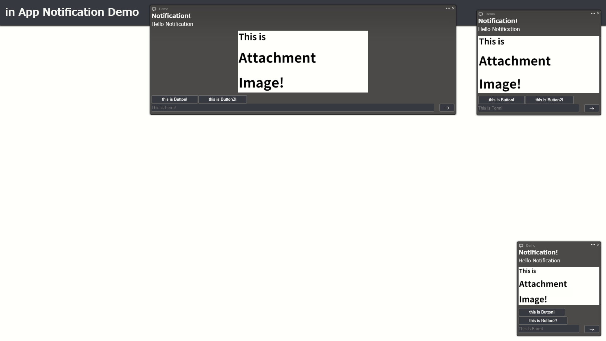
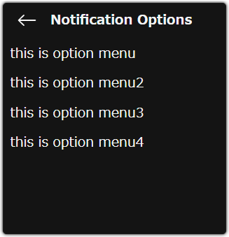

# web-in-app-notification
A javascript Library for to create awesome Notifications 


# Features
+ Create in App Notification
+ Many useful opions
+ Embed interactive contents

# Screenshot


# Install
### script
`<script src="path/to/dist/index.min.js"></script>`


`<script src="https://unpkg.com/web-in-app-notification/dist/index.min.js"><script>`

### CSS
`<link rel="stylesheet" href="path/to/dist/style.css">`


`<link rel="stylesheet" href="https://unpkg.com/web-in-app-notification/dist/style.css">`


# How to use
## create new notification
```javascript
    const myNotification = new inAppNotification(options);
```

## options
All properties can be omitted.

If these properties are omitted, the default values will be applied.
```typescript
{
    time: number, //default:5000
    type: "top" | "bottom-right" | "top-right", //default:bottom-right
    title: string, //default:""
    description: string, //default:""
    attachment: inAppNotificationImage, //default:null
    interactions: {
        buttons:inAppNotificationButton[], //default:null
        form:inAppNotificationInput //default:null
    },
    thumbnail: inAppNotificationImage, //default:null
    header: string, //defalut:""
    footer: string, //default:""
    controls: "visible" | "x" | "menu" | "hidden", //default:"visible"
    onclick: Function, //default:null
    appendTo: HTMLElement, //default:document.body
    sound: HTMLAudioElement | string, //default:null
    menus: inAppNotificationMenuOption[] //default:null
}
```
+ `time` : Displayed duration(ms)
+ `type` : Display position
+ `title` : Title text (bold)
+ `description` : Description of notification
+ `attachment` : Image attachment
+ `interactions` : Embed an interative contents
+ `thumbnail` : Small image in header
+ `header` : Header text (small and gray)
+ `footer` : Footer text (small and gray)
+ `onclick` : The action to be performed when clicked
+ `appendTo` : Parent Element of the Notification
+ `sound` : Play a sound
+ `menus` : Advanced options
  

## inAppNotificationImage
Embed an image in the notification.
```typescript
{
    src: string,
    alt: string
}
```
+ `src` : Image URL.
+ `alt` : Alternative text (can be omitted)

## inAppNotificatonButton
```typescript
{
    text: string,
    onclick: Function,
    clickToHide:boolean
}
```
+ `text` : Button text
+ `onclick` : The action to be performed when clicked
+ `clickToHide` : If true, the notification disappear when clicked (can be omitted)

## inAppNotificationInput
```typescript
{
    placeholder: string,
    onsubmit: Function,
    submitToHide:boolean
}
```
+ `placeholder` : placeholder text (can be omitted)
+ `onclick` : The action to be performed when submit
+ `clickToHide` : If true, the notification disappear when clicked (can be omitted)

## inAppNotificationMenuOption
```typescript
{
    text: string,
    onclick: Function
}
```

+ `text` : Button text
+ `onclick` : The action to be performed when clicked

## Advanced Options menu
click three dots 



